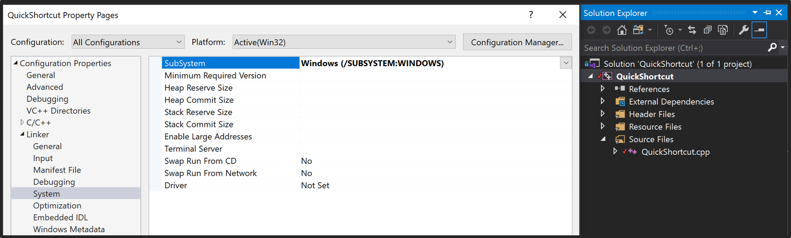
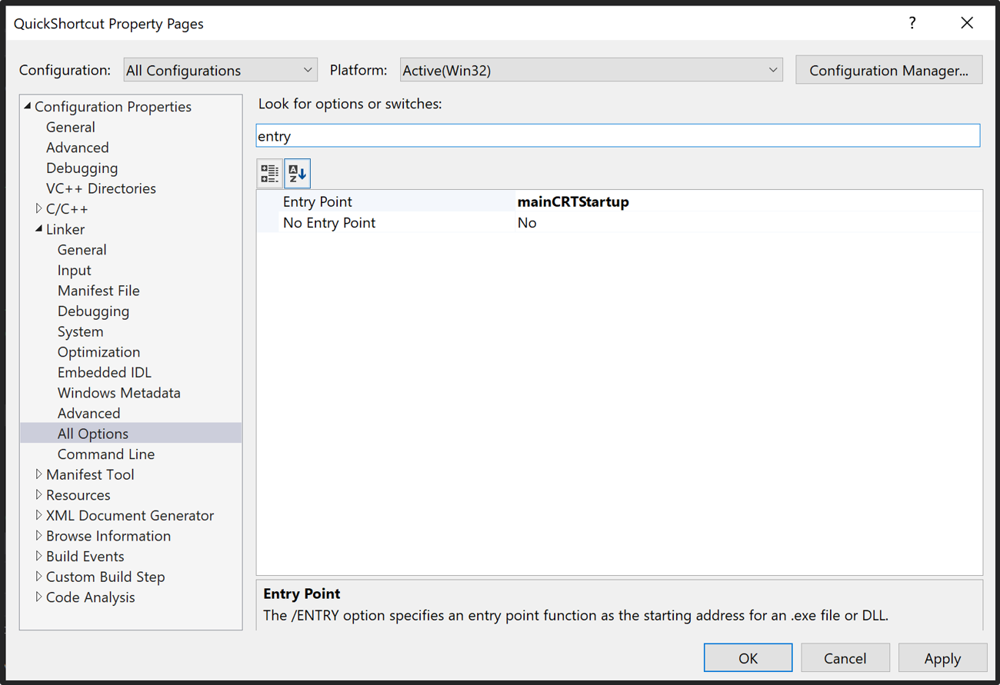

# QuickShortcut
A compact application performs shortcuts action. It can be easily pin to the windows 10 taskbar.  

These exe applications are placed in the Applications folder.  
1. **QuickShortcut-SnippingTool.exe** performs shortcuts **Windows + Shift + S**.  
2. **QuickShortcut-PasteTool.exe** performs shortcuts **Ctrl + V**.  

I written this project in visual studio 2019.

## How to create a console application without console?
Here are the steps.

